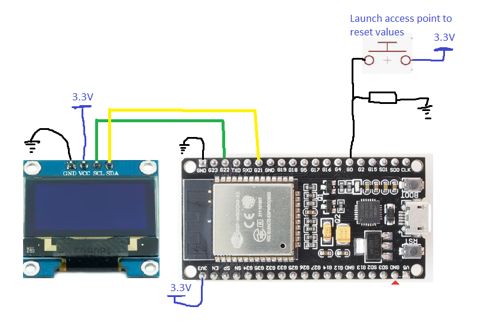
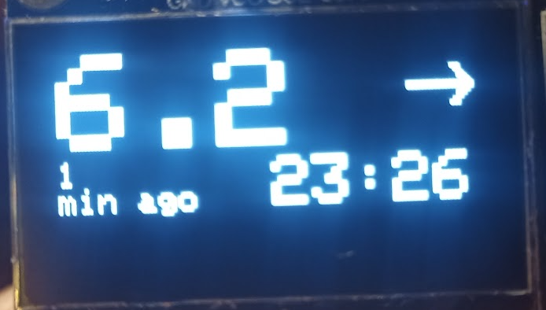
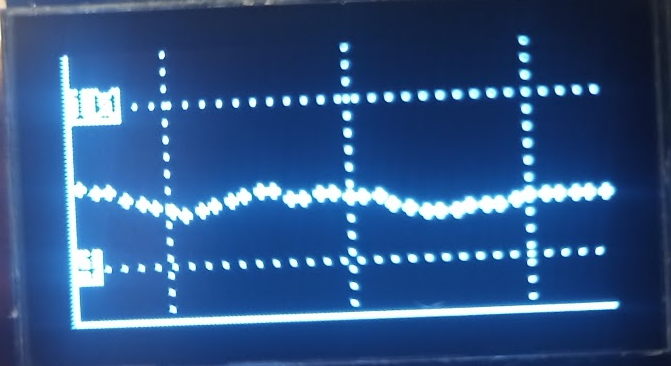

# ESP32_dex

# I am not a medical professional and this code should not be used to make medical decisions. Use at your own risk and remember to always use approved methods to check your blood sugar.  

# Dexcom_Follow
a library to connect to Dexcom Follow from a Esp32.  using my other library Dexcom_follow

# Differance from Dexcom_follow

This is a platformIO arduino project.  If you have visual studio code and platformio extension then you should be able to open the folder and build and flash directly to an esp32 board.
I use the esp32 dev kit 1 but i imagine it will work with most of the original ESP32 boards.  not tested on the newer boards.
It uses a sdd1306 i2c screen to display info.

to setup the board you can connect to it via wifi from a smartphone as it makes an access point.  
Here you can type in the wifi credentials and Dexcom Credentials needed.
If it cannot connect the Wifi Access point will be launched again.

It will retain info on reboot.

If you wish to launch the Access point manually and change credentials, you can pull GPIO0 high.  this will trigger an interrupt to launch the Access point.

It is dependant on the Wifimanager library.  All dependencies can be seen in platformio.ini

# Background
I'm a dad to a son with T1 Diabetes.  I wanted to explore the possibility of connecting to the dexcom follow API from low cost hardware.

I've included a simple example sketch to get you started.  I hope Someone somewhere finds this and puts it to use.  
I will when possible push updates as they come and work on improving the Dexcom follower class i've made here.

let me know if you've put it to good use or you have spotted a flaw.

# Note

This is a work in progress still.  I roll updates out as i add functionality so keep an eye on the project.  

22.08.23 -recently i have added basic support for LED status lights

 
